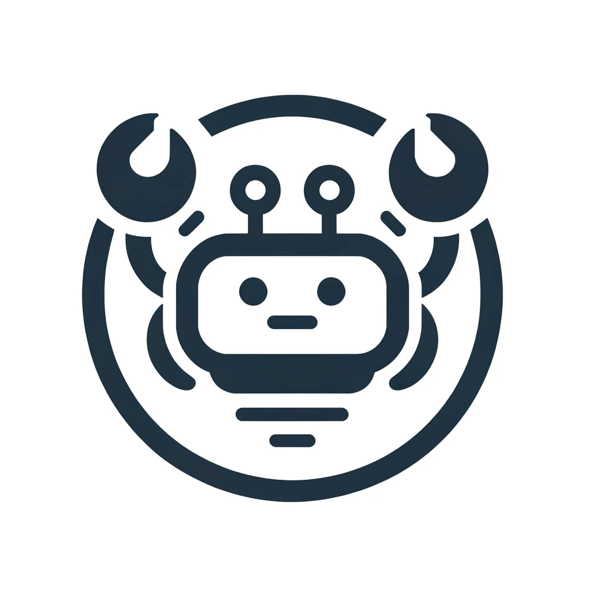

# talkr
A simple Rust Web App prototype for an AI Chatbot.

### UI Demo

### Components

#### Backend
* [Rust](https://www.rust-lang.org/)
* [Actix Web](https://actix.rs/)

#### Frontend
* HTML
* JavaScript
* CSS

### Instructions

* Make sure you have **Rust** installed
* From a terminal, run: `cargo build --release`
* Run the create: `cargo run release`
  * You can also run the standalone binary without cargo: `./target/release/talkr`
* From a browser, go to `http://localhost:3030`

### Misc

* By default, Actix Web spins up 20 workers
* Log level is set to `INFO`

